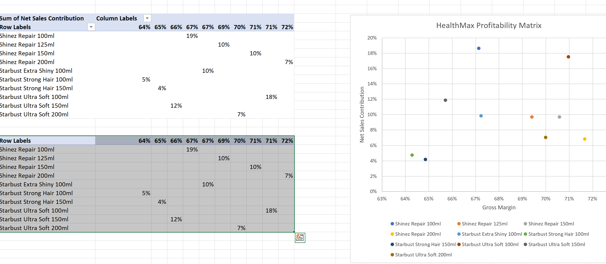
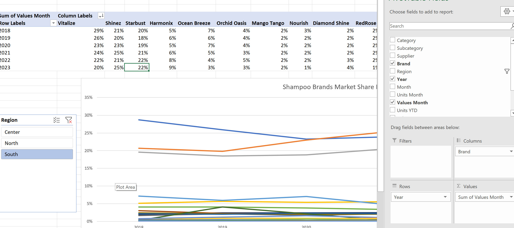
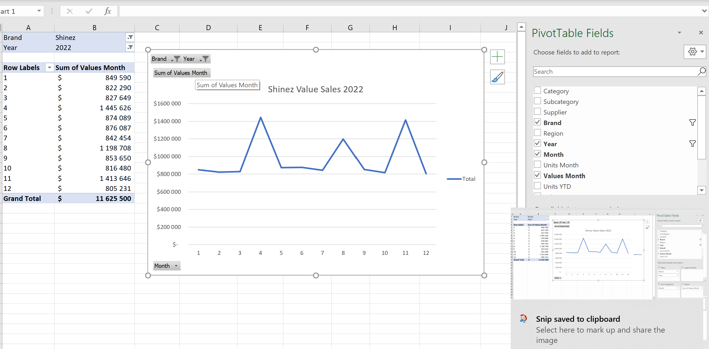
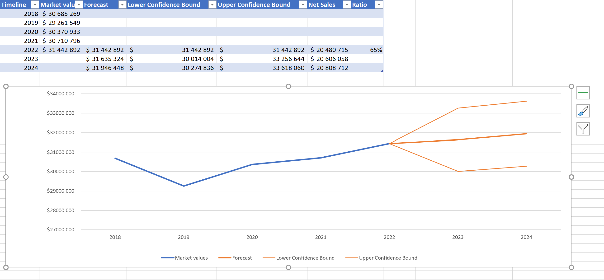
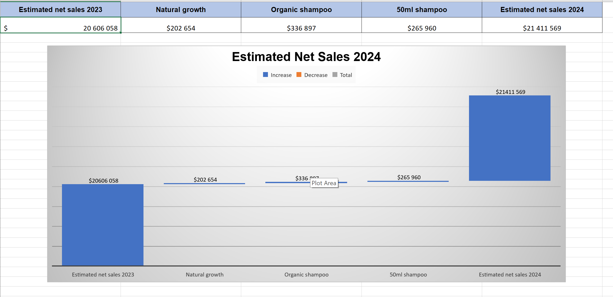

# net-revenue-management-analysis-excel

Excel case study analyzing net revenue growth, product contribution, and forecast trends.

## 1) Project Overview

This project analyzes company revenue performance using Microsoft Excel. 

The goal was to evaluate revenue growth, product contribution, and forecast net sales.

## 2) Tools Used

- Microsoft Excel
- Pivot Tables
- Pivot Charts
- Waterfall Chart
- Forecast analysis
- Excel formulas

## 3) Data Source

This project was completed as part of a DataCamp Excel case study focused on net revenue management and business performance analysis.

The dataset contains simulated company sales and product performance data, including revenue trends, market share, product launches, and profitability metrics across multiple years.

Additional dashboard elements, calculations, charts, and analytical insights were developed and customized in Microsoft Excel to extend the original case study.

## 4) Key Analysis

• Calculated Net Sales growth between 2022, 2023, and 2024  
• Evaluated natural growth vs product-driven growth  
• Analyzed the impact of new products such as Organic Shampoo and 50ml Shampoo

## 5) Key Skills Demonstrated

- Data cleaning
- Revenue analysis
- Forecast modeling
- Dashboard creation
- Business KPI analysis

## 6) Example Insights

- Natural growth contributed the majority of revenue growth.
- Product launches generated additional incremental sales.

## 7) Files

- 1_1_investigating_the_dataset - Starting file to begin project
- net_revenue_management_analysis_complete – Excel analysis and dashboards.
- estimated_net_sales_2024
- forecast_2024
- market_share
- profitability_matrix
- promotion_graph
